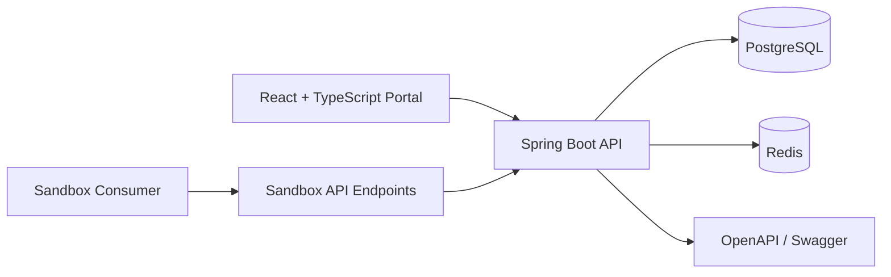

# API Control Plane

[](https://github.com/shuoliugit/dev-platform/actions/workflows/ci.yml)

`api-control-plane` is a production-style mini developer platform. It demonstrates how an API provider can onboard developers, issue credentials, manage application provisioning, expose sandbox APIs, enforce client-level rate limits, and surface usage data through a full-stack control plane.

## What It Shows

- Production-oriented backend structure with Spring Boot controllers, services, repositories, validation, centralized errors, and tests.
- JWT authentication with `DEVELOPER` and `ADMIN` roles.
- Developer portal workflows for app registration, credential generation, credential rotation, and usage review.
- Admin portal workflows for approval, rejection, provisioning, and disabled already-provisioned actions.
- Sandbox API gateway simulation with client credential validation, Redis rate limiting, and usage logging.
- PostgreSQL schema migration with Flyway.
- OpenAPI/Swagger docs, Actuator health and metrics, Docker Compose, Kubernetes manifests, Helm starter chart, and CI.

## Architecture



More detail: [docs/architecture.md](docs/architecture.md).

## Repository Layout

```text
api-control-plane/
  backend/                Spring Boot API, domain model, auth, tests
  frontend/               React + TypeScript developer/admin portal
  infra/docker/           Docker Compose local runtime
  infra/k8s/              Kubernetes starter manifests
  infra/helm/             Helm starter chart
  docs/                   Architecture and API examples
  .github/workflows/      CI pipeline
```

## Local Setup

Prerequisites:

- Java 21
- Maven 3.9+
- Node 22+
- Docker and Docker Compose

Run the full stack:

```bash
cd api-control-plane
docker compose -f infra/docker/docker-compose.yml up --build
```

Open:

- Frontend: `http://localhost:3000`
- Backend API: `http://localhost:8080`
- Swagger UI: `http://localhost:8080/swagger-ui/index.html`
- Health: `http://localhost:8080/actuator/health`

Default admin account:

```text
admin@controlplane.local
AdminPassword123!
```

For local development without containerizing the app:

```bash
cd api-control-plane/infra/docker
docker compose up postgres redis
```

```bash
cd api-control-plane/backend
mvn spring-boot:run
```

```bash
cd api-control-plane/frontend
npm install
npm run dev
```

## Core Workflows

1. Register a developer account or log in as the seeded admin.
2. Create a developer application.
3. Generate a client ID and client secret.
4. As admin, approve and provision the application.
5. Call `/api/sandbox/accounts` or `/api/sandbox/payments` with the client credentials.
6. Return to the developer portal and review logged sandbox usage.

## API Surface

- `POST /api/auth/register`
- `POST /api/auth/login`
- `GET /api/auth/me`
- `GET /api/apps`
- `POST /api/apps`
- `PUT /api/apps/{id}`
- `DELETE /api/apps/{id}`
- `POST /api/apps/{id}/credentials`
- `POST /api/apps/{id}/credentials/rotate`
- `GET /api/apps/{id}/usage`
- `GET /api/admin/apps`
- `POST /api/admin/apps/{id}/approve`
- `POST /api/admin/apps/{id}/reject`
- `POST /api/admin/apps/{id}/provision`
- `GET /api/sandbox/accounts`
- `POST /api/sandbox/payments`

Examples: [docs/api-examples.md](docs/api-examples.md).

## Security Notes

- JWTs are signed server-side and include user ID and role claims.
- Developer APIs are owner-scoped by authenticated user ID.
- Admin APIs require `ROLE_ADMIN`.
- Client secrets are BCrypt-hashed at rest and returned only once on create/rotation.
- Provisioned applications cannot be edited, deleted, approved, or rejected through normal workflows.
- Sandbox access requires both approval and provisioning.

## Observability

- `/actuator/health` supports container and platform health checks.
- `/actuator/metrics` exposes baseline JVM, HTTP, datasource, and process metrics.
- Usage events record endpoint, method, status code, request ID, app, and timestamp.

## CI/CD

The GitHub Actions workflow runs:

- Backend build and tests with Maven
- Frontend dependency install and production build
- Backend Docker image build
- Frontend Docker image build

Workflow: [.github/workflows/ci.yml](.github/workflows/ci.yml).

## Design Decisions and Tradeoffs

- The project uses a monorepo to make full-stack review and local orchestration simple.
- Application provisioning is modeled as a small state machine: pending, approved, rejected, then provisioned.
- Sandbox gateway behavior is implemented inside the backend to keep the demo runnable, while preserving separate credentials and rate-limiting semantics.
- Redis uses a fixed-window limiter for clarity. A production gateway would likely use token bucket or sliding-window logic at the edge.
- The Helm chart is intentionally minimal and expects real deployments to integrate external secret management, managed PostgreSQL, and managed Redis.

## Future Improvements

- Add refresh tokens, email verification, password reset, and organization/team membership.
- Introduce audit logs for admin decisions and credential rotations.
- Replace the in-process sandbox simulation with a separate gateway service.
- Add OpenTelemetry traces and Prometheus scraping configuration.
- Add policy-as-code checks for provisioning and per-plan rate limits.
- Publish Docker images to GHCR from protected branches.
