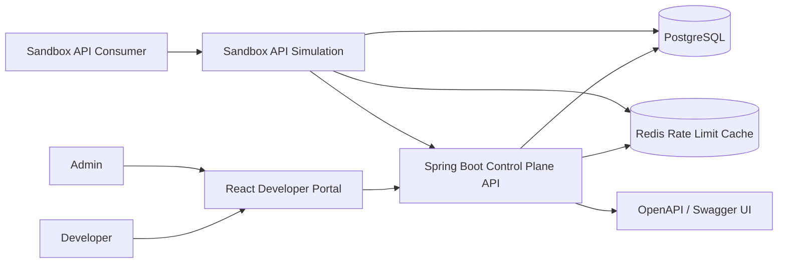

# Architecture

## Runtime Responsibilities

- React portal handles role-aware workflows for developers and admins.
- Spring Boot owns authentication, authorization, application lifecycle, credential issuance, provisioning, usage reporting, and sandbox endpoints.
- PostgreSQL is the system of record for users, applications, credentials, and usage events.
- Redis stores per-client fixed-window rate-limit counters for sandbox traffic.
- Actuator exposes health and metrics endpoints for local and platform probes.

## Trust Boundaries

- Portal traffic authenticates with JWT bearer tokens.
- Sandbox API traffic authenticates with `X-Client-Id` and `X-Client-Secret`.
- Raw client secrets are returned only when generated or rotated. The backend stores BCrypt hashes.
- Admin operations require `ROLE_ADMIN`; developer operations are scoped to the authenticated owner.
